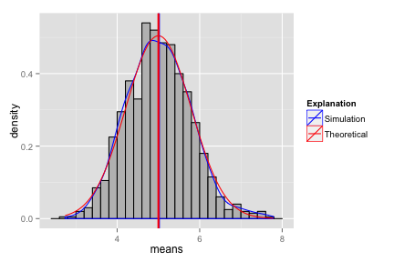
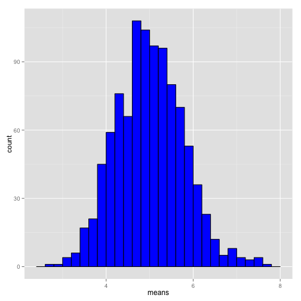

# Statistical Inference - Project Assignment 1
#### Philip Ohlsson
## Overview
This project will investigate the exponential distribution in R and compare it with the Central Limit Theorem. The exponential distribution will be simulated in R with rexp(n, lambda) where lambda is the rate parameter. The mean of exponential distribution is 1/lambda and the standard deviation is also 1/lambda. Set lambda = 0.2 for all of the simulations. 
The project will investigate the distribution of averages of 40 exponentials, which has been made on thousand simulations.

The project will illustrate via simulation and associated explanatory text the properties of the distribution of the mean of 40 exponentials and will show:

1. the sample mean and compare it to the theoretical mean of the distribution.
2. how variable the sample is (via variance) and compare it to the theoretical variance of the distribution.
3. that the distribution is approximately normal.

## Simulation


```r
#Load in the necessary libraries:
library(ggplot2)
#Variables for the simulation: 
lambda <- 0.2 #lambda for rexp
n <- 40 #number of exponentials
no_Sim <- 1000 #number of simulations
#Set the seed for reproducibility:
set.seed(123)
#Run test in a n * noSim matrix:
exp_Dis <- matrix(data = rexp(n*no_Sim, lambda), nrow = no_Sim)
exp_Dis_mean <- data.frame(means = apply(exp_Dis, 1, mean))
```

## Sample mean versus theoretical mean
The theoretical mean, `mu_t`, is calculated using `lambda`: 

```r
mu_t <- 1/lambda; 
mu_t
```

```
## [1] 5
```

The mean of the sample data, `mu_a` is calculated checking the means of `exp_Dis_mean`:

```r
mu_a <- mean(exp_Dis_mean$means); 
mu_a
```

```
## [1] 5.011911
```

When comparing, we see that `mu_t` and `mu_a` are very close to each other.

## Sample variance versus theoretical variance
The theorectical variance, `var_t`, is calculated as following:

```r
var_t <- (1/lambda / sqrt(n))^2; 
var_t
```

```
## [1] 0.625
```
The variance of the sample data, `var_a` is calculated using means from the sample:

```r
var_a <- var(exp_Dis_mean$means); 
var_a
```

```
## [1] 0.6088292
```

Again, the theoretical and actual variance are very close to each other.

## Distribution
In order to check whether the distribution is approximately normal we will do the following:

1. Calculate the distribution of the simulation, check how the data aligns over the histogram, and compare it with the normal distribution and its values.

2. Compare the confidence intervals (95%) of the simulation data with the normal distribution.

3. Make a Q-Q-plot, in order to check the linearity of the points, suggesting whether the simulation data are normally distributed.


### 1. Calculate the distribution of the simulation and compare with the normal distribution 
 

We see that the simulated data fit quite well over the histogram for a normal distribution as well as the theoretical normal distribution (also that the means are very close to each other).

### 2. Compare the confidence intervals
Let's check the confidence interval between the data, `conf_int_a`, and that of the normal distribution, `conf_int_t`:

```r
#Confidence interval for the normal distribution:
alpha <- 0.05
conf_int_t <- round(mu_t + c(-1,1)*qnorm(1-alpha/2)*sqrt(var_t)/sqrt(n), 3)
conf_int_t
```

```
## [1] 4.755 5.245
```

```r
#Confidence interval of the sample data:
conf_int_a <- round(mu_a + c(-1,1)*qnorm(1-alpha/2)*sqrt(var_a)/sqrt(n),3)
conf_int_a
```

```
## [1] 4.770 5.254
```

We can see that the confidence intervals of the simultation and the normal distribution are close to each other.

### 3. Q-Q-plot
The Q-Q-plot will compare the data on the vertical axis to a standard normal population on the horizontal axis.

 

The linearity of the points suggests that the simultation data are normally distributed.
\newpage

## Appendix

### Plot of the simulation with a histogram  

```r
g <- ggplot(exp_Dis_mean, aes(x=means)) + geom_histogram(fill = "blue", 
                binwidth = 0.2, colour = "black")
g
```

 

### Code for illustrating the distribution of the simulation and comparing it with the normal distribution

```r
g <- ggplot(exp_Dis_mean, aes(x=means))
g <- g + geom_histogram(aes(y=..density..), binwidth = 0.2, colour = "black", 
             fill="grey") + 
  geom_density(aes(color = "Simulation"), size = .5) + 
  stat_function(fun = dnorm, aes(color="Theoretical"), 
             arg = list(mean = 1/lambda, 
             sd = 1/lambda/sqrt(n)), size = .5) + 
  geom_vline(aes(xintercept = mean(exp_Dis_mean$means)), 
             color = "blue", size = 1) + 
  geom_vline(aes(xintercept = 1/lambda), color = "red", size = 1) +
  scale_color_manual("Explanation", values = c("Simulation" = "blue",
                                               "Theoretical" = "red"))
```
